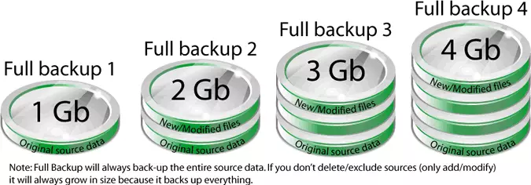
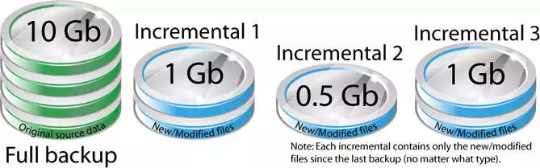
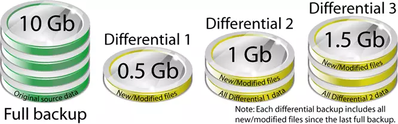

# Backup

El *backup* (respaldo, copia de seguridad) es una *copia de los datos almacenada en un lugar distinto a los datos que se están respaldando*; de manera tal de poder recuperar los datos originales frente a algún evento de pérdida de datos.

Si bien los backups brindan una estrategia de protección frente a la pérdida de datos, no siempre es posible reconstituir un sistema completo a partir de los backups.

Los backups se pueden comprimir (se optimiza el espacio necesario) y cifrar (se aumenta la seguridad, evitando que quien no posea la clave de descifrado pueda restaurar y acceder a los datos). Muchas veces tanto la compresión como el cifrado, se pueden realizar *al vuelo* (mientras se realiza la operación de respaldo).

---

# Método No Estructurado

Puede ser simplemente un conjunto de cintas, DVD, discos rígidos, u otro medio con información mínima sobre qué se respaldó y cuando. Este método es el más fácil de implementar, pero el menos confiable a la hora de restaurar porque no se tiene información acerca de qué contienen las copias ni de cuándo fueron hechas.

---

# Método Completo

> Fuente: https://www.backup4all.com/full-backup-kb.html

Se realiza una copia de *todos* los archivos independientemente de qué archivos se crearon o cambiaron desde la última copia.

---

# Método Completo - Cont.

Una variante de este método es la *Imagen del sistema* donde se utiliza una herramienta para generar una "imagen" de una partición del disco o del disco completo. Sin embargo, esto se utiliza más para replicar sistemas idénticos de manera más sencilla, por ejemplo: se instala y configura todo el software necesario en una computadora, se realiza la imagen, y después se restaura la imagen en todas las computadoras necesarias.

El espacio de almacenamiento necesario es el de todos los archivos cada vez que se realiza la copia. Ejemplo: si se deben realizar tres respaldos de 10GB de archivos, se necesitan 30GB.

---

# Método Incremental

> Fuente: https://www.backup4all.com/full-backup-kb.html

Se copian *solo los archivos que cambiaron desde un punto de referencia en el tiempo*. No se copian archivos duplicados, o archivos que no cambiaron. Típicamente se realiza primero un backup *Completo* de los archivos que se utiliza como "referencia" para los backups incrementales, y luego se van realizando backups incrementales a intervalos regulares. Para restaurar los archivos se necesitan la copia completa más reciente y todas las copias incrementales intermedias.

---

# Método Incremental - Cont.

Algunos sistemas (como el *Time Machine* de Apple Inc.) permiten sintetizar backups completos a partir de un conjunto de copias incrementales automáticamente, brindando así la "ilusión" de tener varias copias completas.

Este método necesita menos espacio de almacenamiento para la copia que el método *Completo*. Ejemplo: si se deben realizar tres respaldos de 10GB de archivos, pero entre el primero y el segundo sólo cambiaron o se crearon 1GB, y entre el segundo y el tercero sólo cambiaron o se crearon 3GB, sólo se necesitan 14GB, en lugar de 30GB.

---

# Método Diferencial

> Fuente: https://www.backup4all.com/full-backup-kb.html

Se copian *solo los archivos que cambiaron o se crearon desde el último backup completo*. Esto implica que para restaurar un sistema solo se necesitan dos copias, el último backup *Completo* y su backup *Diferencial*.

---

# Método Diferencial - Cont.

Sin embargo, a medida que transcurre el tiempo desde el último backup *Completo*, y los cambios en los archivos se van incrementando, también se incrementará el tiempo necesario para realizar el backup *Diferencial*.

Un backup *Diferencial* copia los archivos que se crearon o cambiaron desde el último backup *Completo*, sin importar si se hicieron otros backups diferenciales "en el medio"; mientras que un backup *Incremental* copia los archivos que se crearon o cambiaron desde el último backup de cualquier tipo (ya sea *Completo* o *Incremental*). Por lo tanto, el método *Diferencial* necesita menos espacio que el *Completo*, pero más que el *Incremental*.

---

# Medios de almacenamiento

Sin importar qué método de backup se utilice, el backup se debe almacenar en algún medio de almacenamiento de datos, también conocido como el "destino" del backup.

---

# Cinta Magnética (*Tape*)

Durante muchos años fueron el medio más utilizado para realizar backups, archivado de datos e intercambiar grandes cantidades de información. La cinta es un medio de acceso secuencial por lo que la velocidad de lecto-escritura continua (de datos contiguos) puede ser muy elevada.

Las capacidades típicas de las cintas actuales se encuentran en el orden de 15 a 20 GB, aunque hay fabricantes (*Fujifilm* y *Sony*) que anunciaron (en el año 2014) capacidades del orden de los 180 a 250 GB.

---

Entre los problemas de la cinta se destacan:

* La compatibilidad. Existen varios sistemas de tipos de cinta, incompatibles entre sí. Sin embargo, hoy día parece haber un estandar aceptado: [LTO](https://en.wikipedia.org/wiki/Linear_Tape-Open), con una durabilidad de entre 15 y 30 años.
* La confiabilidad. Las cintas se arruinan "con facilidad" y son sensibles a los campos magnéticos potentes, pudiendo borrarse por completo si son sometidas a dichos campos.
* El rendimiento de acceso aleatorio. Esto impactaría la restauración de archivos selectiva ya que el medio tiene que ser "recorrido" de manera secuencial hasta encontrar los archivos en cuestión.
* El ruido. En general son muy ruidosos durante la restauración debido al ruido que generan los motores al rebobinar o avanzar las cintas en búsqueda de la información a restaurar.

---

# Almacenamiento Óptico (*CD*, *DVD*, *Blu-Ray*)

El almacenamiento óptico utiliza lásers para escribir y leer la información. Los discos *CD*, *DVD* y *Blu-Ray* (re-)grabables son de uso común en computadoras personales y en general son baratos.

Al principio estos medios eran mucho más lentos que las cintas y que los discos rígidos, pero los avances tecnológicos acortaron la brecha.

---

La capacidad va desde 0.7GB (*CD*) a 25-128GB (*Blu-Ray* de una a cuatro capas).

Según un estudio de 2008 el tiempo de vida de los *CD* grabables (*CD-R*) vendidos típicamente era de 2 a 10 años, pero más tarde un fabricante estimó la longevidad de sus *CD-R* recubiertos en oro en más de 100 años. Para más información se puede consultar un [estudio del Gobierno de Canadá sobre la vida útil de distintos medios de almacenamiento óptico](https://www.canada.ca/en/conservation-institute/services/conservation-preservation-publications/canadian-conservation-institute-notes/longevity-recordable-cds-dvds.html) (en inglés).

---

# Disco Rígido

El uso de los discos rígidos como medio de almacenamiento para los backups se popularizó en los últimos años debido a la reducción de los costos y al aumento de la capacidad de los mismos. Por lo general, los discos rígidos son de fácil uso, es muy fácil conseguirlos, y son de fácil acceso.

Sin embargo, cabe recordar que los discos rígidos son dispositivos mecánicos (con partes móviles) y que están sujetos al mismo tipo de fallas que los medios que contienen los datos que se intentan resguardar (el disco rígido de nuestra computadora), y además corren riesgo de dañarse durante su transporte.

En los últimos años (2005-2015) los discos rígidos portátiles incluyen tecnologías (rampa de carga y acelerómetro) para minimizar (o anular por completo) los daños producidos por las caídas de los discos mientras no se encuentran en operación. Algunos discos rígidos portátiles (*rugged*) incluyen una funda de absorción de impactos.

---

# Almacenamiento de Estado Sólido (*SSD*, *pendrive*, tarjetas *SD*, *CompactFlash*, etc.)

Los discos (o tarjetas de memoria) de estado sólido utilizan circuitos integrados (de memoria no volátil, tipo *flash*) para almacenar datos.

Los dispositivos de estado sólido son relativamente caros debido a su limitada capacidad (con respecto a los discos rígidos), pero son convenientes para almacenar cantidades limitadas de información en un espacio reducido y muy portátil.

Los dispositivos de estado sólido no tienen partes móviles, lo que los hace mas resistentes al daño físico (rotura por caídas por ejemplo) y pueden tener una tasa de transferencia de datos muy elevada, de hasta 6 Gbit/seg.

---

# Almacenamiento Remoto

El almacenamiento remoto, o *en la nube*, implica que se contrata un proveedor de servicios de almacenamiento online. También se puede utilizar otro equipo en la red LAN con software adecuado para realizar almacenamiento "remoto"; no obstante aquí nos referimos al almacenamiento en la nube u *off-site*, en otro sitio apartado geográficamente y operado por un tercero.

Este medio de almacenamiento se usa para protegerse de desastres naturales como incendios, inundaciones o terremotos que pueden destruir los backups almacenados de manera local.

Sin embargo, se debe confiar en que el proveedor del servicio mantenga la privacidad y la integridad de nuestros datos. Se pueden usar soluciones de cifrado para mejorar la confidencialidad de la información. Otros factores a tener en cuenta son la velocidad y la disponibilidad, limitadas por la calidad de nuestra conexión de Internet, y el costo por GB.

---

> Fuente. Wikipedia: https://en.wikipedia.org/wiki/Backup